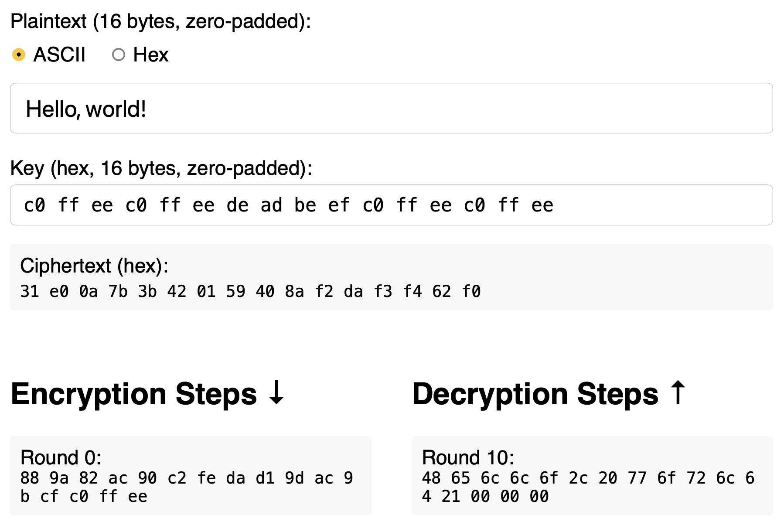

# AES (Advanced Encryption Standard) Symmetric Block Cipher

AES is a symmetric block cipher. It is symmetric because it uses the same key to encrypt and decrypt, and is a block cipher because it operates on individual, independent blocks of data. It is typically used for encryption and decryption.

## Usage

### Encryption

Full, end-to-end encryption of plaintext to ciphertext.

```sh
$ cat aes.key
-my-16-byte-key-
$ echo 'Hello, world!' | tiber --output-hex encrypt --key aes.key
b1a4cd8fc4d3544b5c51623be45f1fc9
```

### Decryption

Full, end-to-end decryption of ciphertext to plaintext.

```sh
$ echo 'b1a4cd8fc4d3544b5c51623be45f1fc9' | tiber --input-hex decrypt --key aes.key
Hello, world!
```

### Individual Steps

Apply a particular step of the AES algorithm: one of `sub-bytes`, `shift-rows`, `mix-columns`, or `add-round-key`.

```sh
$ echo 'Hello, world!' | tiber shift-rows
H,l or lo lw!e d
```

## Web Interface

The cipher can be interacted with through a web interface, by running the following command and opening [localhost:8080](localhost:8080).

```sh
$ docker run -p 8080:80 benmandrew/tiber
```



## Build

```sh
$ make
```
