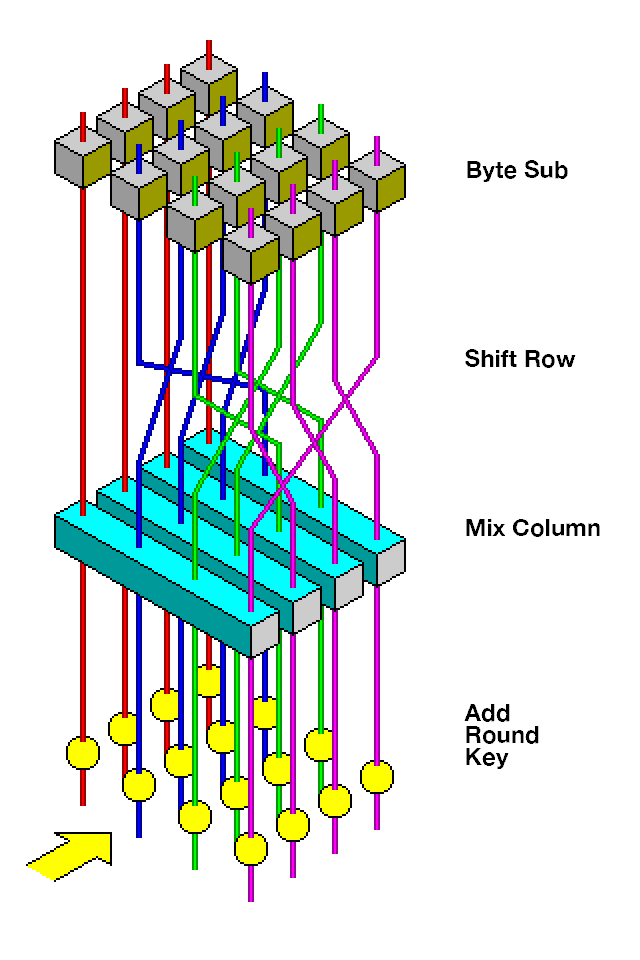

# AES (Advanced Encryption Standard) Symmetric Block Cipher

AES is a symmetric block cipher. It is symmetric because it uses the same key to encrypt and decrypt, and is a block cipher because it operates on individual, independent blocks of data.

(Image from [Wikipedia](https://en.wikipedia.org/wiki/Advanced_Encryption_Standard).)
